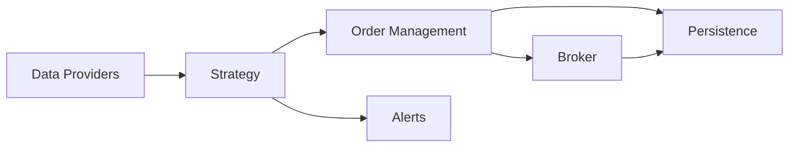

# Architecture

Overview of the system’s responsibilities, execution modes, and data flow.

## Components

- Data Providers (`data_providers.py`)
  - IBKR-backed historical bars and quotes.
  - Interval/bar-size mapping (e.g., `60min` -> `1 hour`, `daily` -> `1 day`).
  - Duration selection (`compact` vs `full`) and throttled, retried requests.
- Strategy (`strategy.py`)
  - Vectorized indicators (SMA, EMA, RSI, MACD, ATR, Supertrend, OBV).
  - Scoring engine (trend, momentum, volume, setup) with sentiment gate.
  - Support proximity analysis for entries (ATR and percent distances).
  - 4H rollup of 1H bars aligned to session times.
- Order Management (`order_management.py`)
  - Creates bracket orders (entry, stop, TP1/TP2) and persists them.
  - Adjusts stops, promotes to trailing, and upgrades trailing stops.
- Broker (`brokers.py`, `ibkr_client.py`)
  - IBKR client for account summary, historical data, and order placement.
  - Parent/child `parentId` wiring and OCA groups for one-cancels-all.
- Persistence (`data_access.py`)
  - SQLite storage using WAL and indices on common columns.
- Alerts (`alerts.py`)
  - Optional push notifications via Pushover.

## Execution Modes

- Scan: `python main.py scan` (or `SCAN_ONLY=1`) to score the universe without
  placing orders. Runs anytime.
- Live: `python main.py` runs a single hourly pass during market hours, detects
  regime, evaluates entries, and manages open positions. Orders are submitted
  only if `ENABLE_TRADING=1`.

## Entry Criteria

All must be satisfied to place an entry:
- Entry score >= threshold after sentiment adjustments (default 70)
- Price near prioritized support (within ATR or percent thresholds)
- Risk and sizing valid given account equity

Account equity resolves from IBKR `NetLiquidation` when available; otherwise the
`ACCOUNT_EQUITY` env value is used.

## entry conditions
The bot enters a trade only when all of the following conditions are satisfied:

**1- High entry score:**
A composite “entry score” is computed from four weighted categories—trend (45 pts), momentum (30 pts), volume (15 pts), and setup/location (10 pts). Each category contributes points through specific rules such as price above key moving averages and bullish supertrend (trend), RSI and MACD signals (momentum), strong relative volume and positive OBV slope (volume), and pullback-within-value or upper-half Bollinger position (setup)

**2- Sentiment gate:**
The score is adjusted for market sentiment. Extreme fear (<25) or a risk‑off regime with low score/negative news blocks the trade, while positive or negative news further tweaks the score

**3- Score threshold:**
After sentiment adjustments, the entry score must be at least 70 to proceed

**4- Price near support:**
The symbol’s price must sit near a prioritized support level—within 0.5 ATR or 0.5 % of that support

Only when all these criteria are met does the strategy place an order for that symbol.

## Data Flow

1) Strategy fetches historical data via the provider (throttled). 2) Indicators
are computed, scores are derived, sentiment is applied. 3) When criteria are
met, Order Management builds a bracket and sends to the Broker. 4) Orders and
positions are persisted. 5) Alerts are emitted for key events.

