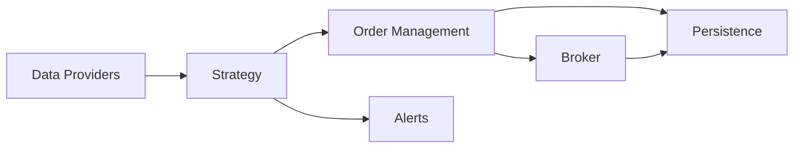

# Architecture

This document outlines the high-level responsibilities and data flow between modules in the trading bot.

## Module Responsibilities

- **Data Providers** (`data_providers.py`)
  - Fetch historical and real-time market data from external APIs.
  - Supply price information and indicators to the strategy layer.
- **Strategy** (`strategy.py`)
  - Analyse incoming market data and account state.
  - Generate trading signals and decide when to place orders.
- **Order Management** (`order_management.py`)
  - Translate strategy signals into concrete orders.
  - Coordinate with the broker, maintain open positions and manage stops.
- **Broker** (`brokers.py`, `ibkr_client.py`)
  - Execute orders and provide account details.
  - Acts as the gateway to external trading venues.
- **Alerts** (`alerts.py`)
  - Send push notifications for important events such as fills or errors.
- **Persistence** (`data_access.py`)
  - Store orders, positions and analytics snapshots in the SQLite database.

## Data Flow

The bot begins by gathering data from **Data Providers**. The **Strategy** processes this data and determines whether to act. When a trade is required, it communicates with **Order Management**, which builds orders and forwards them to the **Broker** for execution. Both order events and broker feedback are written to **Persistence**. Important events trigger **Alerts** to notify the user.

