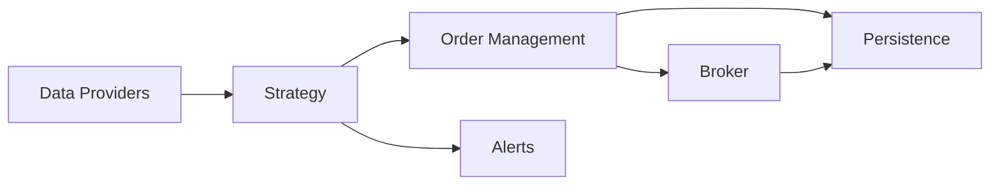

# Architecture

This document outlines the high-level responsibilities and data flow between modules in the trading bot.

## entry conditions
The bot enters a trade only when all of the following conditions are satisfied:

**1- High entry score:**
A composite “entry score” is computed from four weighted categories—trend (45 pts), momentum (30 pts), volume (15 pts), and setup/location (10 pts). Each category contributes points through specific rules such as price above key moving averages and bullish supertrend (trend), RSI and MACD signals (momentum), strong relative volume and positive OBV slope (volume), and pullback-within-value or upper-half Bollinger position (setup)

**2- Sentiment gate:**
The score is adjusted for market sentiment. Extreme fear (<25) or a risk‑off regime with low score/negative news blocks the trade, while positive or negative news further tweaks the score

**3- Score threshold:**
After sentiment adjustments, the entry score must be at least 70 to proceed

**4- Price near support:**
The symbol’s price must sit near a prioritized support level—within 0.5 ATR or 0.5 % of that support

Only when all these criteria are met does the strategy place an order for that symbol.

## Module Responsibilities

- **Data Providers** (`data_providers.py`)
  - Fetch historical and real-time market data from external APIs.
  - Supply price information and indicators to the strategy layer.
- **Strategy** (`strategy.py`)
  - Analyse incoming market data and account state.
  - Generate trading signals and decide when to place orders.
- **Order Management** (`order_management.py`)
  - Translate strategy signals into concrete orders.
  - Coordinate with the broker, maintain open positions and manage stops.
- **Broker** (`brokers.py`, `ibkr_client.py`)
  - Execute orders and provide account details.
  - Acts as the gateway to external trading venues.
- **Alerts** (`alerts.py`)
  - Send push notifications for important events such as fills or errors.
- **Persistence** (`data_access.py`)
  - Store orders, positions and analytics snapshots in the SQLite database.

## Data Flow

The bot begins by gathering data from **Data Providers**. The **Strategy** processes this data and determines whether to act. When a trade is required, it communicates with **Order Management**, which builds orders and forwards them to the **Broker** for execution. Both order events and broker feedback are written to **Persistence**. Important events trigger **Alerts** to notify the user.

